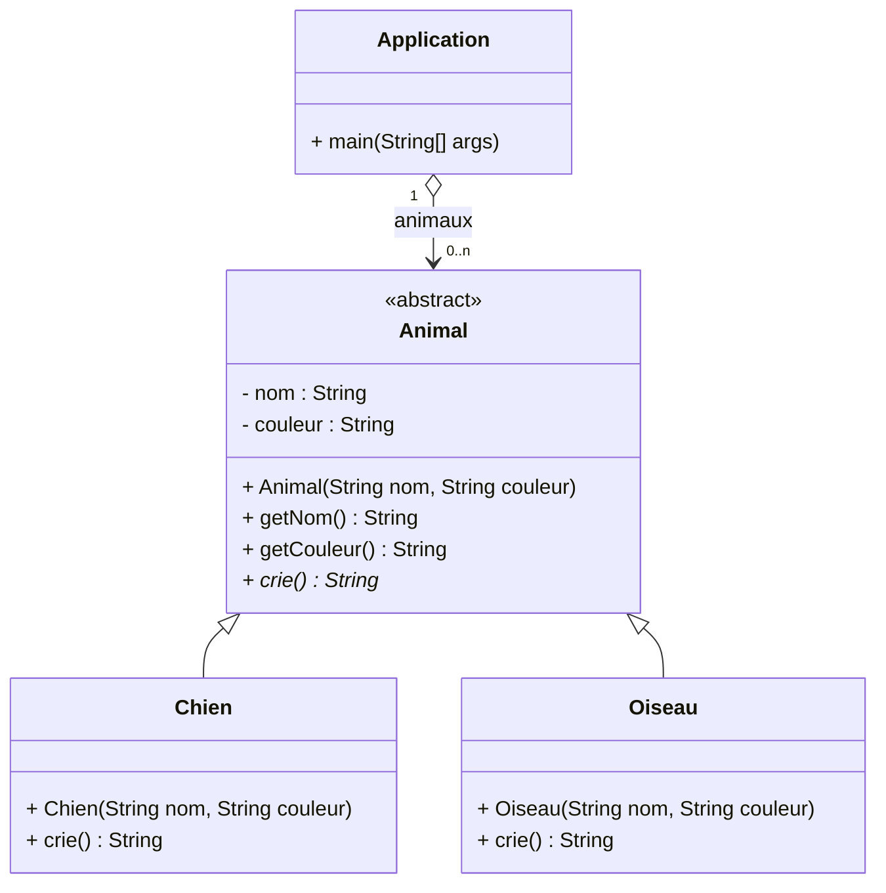
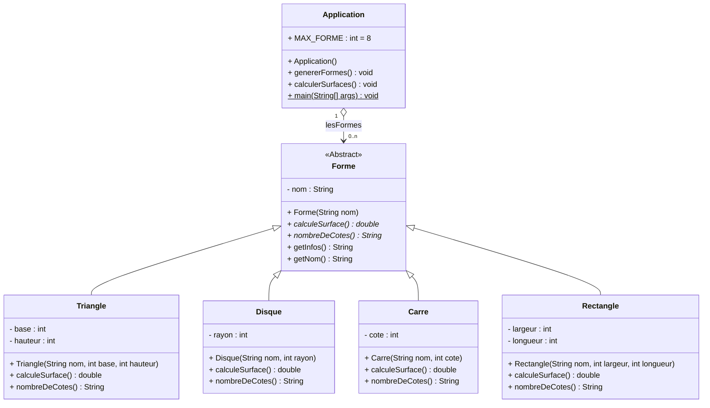
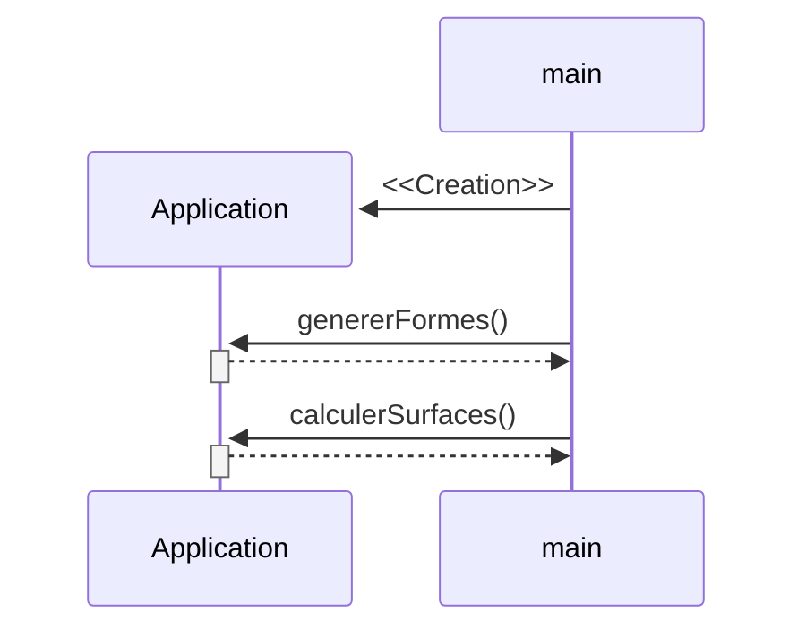
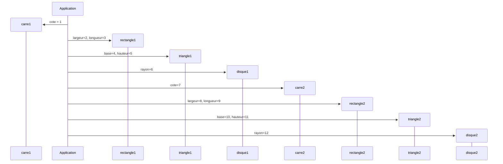

# Les Formes abstraites

## Durée : 30'

## Objectifs
- Réactivation des fondamentaux Java : classes et objets.
- Mise en pratique de l'héritage.
- Découverte et mise en pratique des méthodes et classes abstraites.

## Les classes et méthodes abstraites

Une méthode abstraite est une méthode déclarée mais sans son implémentation, sans son code. Par exemple :
```java
public abstract double faudraImplementerCaPlusTardHein(double a, double b);
```
Une classe abstraite, est une classe dans laquelle il y a au moins une méthode abstraite et/ou qui a été marqué ainsi. Par exemple :
```java
public abstract class MotherOfFutureImplementation {
    public abstract double faudraImplementerCaPlusTardHein(double a, double b);
}
```

Pour que Java comprenne la situation et accepte cette absence d'implémentation, il faudra utiliser le mot-clé `abstract`. La méthode ne sera donc plus concrète mais abstraite car le code de son implémentation n'est pas disponible/fourni. Et comme toute méthode se trouve forcément dans une classe, puisqu'au moins une des méthodes de cette classe sera abstraite, la classe le deviendra elle aussi. Elle nécessitera dès lors également l'utilisation du mot-clé `abstract` pour que Java comprenne la situation et l'accepte.

    Une classe abstraite ne peut pas être instanciée directement car il lui manque encore des choses (abstraite).
    Il ne sera pas possible de faire un objet à partir de cette classe (car pas concrète).

Par contre cela est **très utile**, car cette classe abstraite pourra **servir de modèle** à d'autres classes qui en hériterons et qui fourniront ce code manquant afin de devenir des classes concrètes, et donc instanciables afin d'en produire des objets.

Les classes abstraites sont **utilisées lorsqu'on veut définir un comportement commun** a plusieurs classes sans avoir à fournir d'implémentation pour ce que l'on ne sait pas faire. Elles permettent de s'assurer que certaines méthodes seront présentes dans toutes les sous-classes, en laissant la liberté à ces sous-classes de définir comment ces méthodes abstraites devront se comporter.

**Prenons un exemple:**

Nous voulons faire une application qui gère des animaux. Nous allons donc faire une classe qui s'appelle `Animal` avec les caractéristiques nom et couleur et qui devra savoir s'exprimer.

Lors de l'implémentation, il sera difficile, voir même impossible, de dire combien de pattes un animal possède, d'autant qu'il n'y a pas de valeur par défaut. Ce qui est sûr par contre, c'est que chaque animal, donc sous-classe, **devra** fournir cette information.

L'implémentation sera donc que la classe animal prévoira de complètement gérer le nom et la couleur de l'animal comme attribut, en fournissant directement tout le code nécessaire, mais prévoira la présence d'un savoir-faire abstrait, une méthode abstraite `crie()`, qui sera ensuite définie dans les futures sous-classes.


> Les méthodes abstaites sont représentées en *italique* dans un diagramme UML. 

Et l'implémentation de cela en `Java` serait la suivante :
```java
public abstract class Animal
{
    private String nom;
    private String couleur;

    public Animal(String nom, String couleur)
    {
        this.nom = nom;
        this.couleur = couleur;
    }

    public String getNom()
    {
        return nom;
    }

    public String getCouleur()
    {
        return couleur;
    }

    public abstract String crie();
}

public class Chien extends Animal
{
    public Chien(String nom, String couleur)
    {
        super(nom, couleur);
    }

    @Override
    public String crie()
    {
        return getNom() + " fait Ouaf, ouaf";
    }
}

public class Oiseau extends Animal
{
    public Oiseau(String nom, String couleur)
    {
        super(nom, couleur);
    }

    @Override
    public Override String crie()
    {
        return getNom() + " fait Piou, piou";
    }
}

public class Application{

    public static void main (String[] args)
    {
        ArrayList<Animal> animaux = new ArrayList<Animal>();
        animaux.add(new Chien("Médor", "Blanc"));
        animaux.add(new Chien("Felix", "Noir"));
        animaux.add(new Oiseau("Hirondelle", "Noir"));

        for(Animal animal : animaux)
        {
            System.out.println(animal.crie());
            if(animal instanceOf Chien)
            {
                System.out.println("Il s'agit d'un chien !!!");
            }
        }
    }
}
```

***Rappel:***

**extends**: Définit de quelle classe on va hériter.
```java
public class Chien extends Animal
```
La classe Chien hérite de la classe Animal.

**super()**: Appelle le constructeur de la classe parent, peu importe son nom.
```java
    public Chien(String nom, String couleur)
    {
        super(nom, couleur);
    }
```
Appelle le constructeur de la classe `Animal` avec les paramètres reçus dans le constructeur `Chien`.

**this**: Fait référence à l'objet en cours.
```java
    private String nom;
    private String couleur;

    public Animal(String nom, String couleur)
    {
        this.nom = nom;
        this.couleur = couleur;
    }
```
`this.nom` fait référence à l'attribut `private String nom;` de l'objet en cours `this`, alors que `nom` fait référence au paramètre nom passé au constructeur.

**instanceOf**: Permet de savoir si l'objet est bien une instance d'une classe spécifiée.
```java
    for(Animal animal : animaux)
    {
        if(animal instanceOf Chien)
        {
            System.out.println("Ceci est bien un chien");
        }
    }
```
En parcourant les objets présents dans la liste `animaux`, nous vérifions si l'objet courant est bien une instance de la classe `Chien`. Retourne `true` si c'est bien une instance de la classe `Chien`, sinon retourne `false`.

**Acceder aux méthodes du type de l'enfant**: Lorsque l'on parcours la liste animal, la réference est de type Animal, c'est à dire que seul les méthodes définies dans le type Animal seront disponbiles. 
Dans certain cas particulier, on peut vouloir appeler des méthodes des classes enfants (Chien et Oiseau). 
POur cela il sera nécessaire de *caster* le type parent en type enfant.

```java
    for(Animal animal : animaux)
    {
        if(animal instanceOf Chien)
        {
            //l'instruction (Chien) transforme l'objet animal en   
            //objet chien, pour autant que l'instantce de animal soit de type Chien (contrôle ci-dessus)
            Chien monChien = (Chien) animal;
            //je pourrais ensuite appeler les méthodes qui seraient définies uniquement dans Chien
            //monChien.maMethodeDeChien();
        }
    }
```

## Travail à réaliser

Recopiez vos classes (modèles) du projet précédent `320_EX_04_FORMES_BASE` fait précédement.

En vous basant sur les différents diagrammes ci-dessous, apportez les modifications suivantes :
- La classe Forme devient une classe abstraite. 
- Elle prévoit deux méthodes abstraites calculeSurface() et nombreDeCotes() devant être implémentées par ses descendants.
- Elle introduit une nouvelle méthode getInfos() servant à produire un texte donnant toutes les informations utiles sur un objet de type Forme, qui sera utilisée par le main() pour afficher les formes.


Créez ensuite une classe `Application` possédant une méthode `main` respectant les diagrammes de séquences suivants :

### Méthode main(String[] args)


### Méthode calculerSurfaces()

```mermaid

sequenceDiagram
    create participant double laSurfaceTotale
    calculerSurfaces()->>+ double laSurfaceTotale: 0.0
    alt lesFormes != null
        loop i < lesFormes.length
            calculerSurfaces() ->>+ calculerSurfaces(): uneForme = lesFormes[i]
            alt uneForme != null
                calculerSurfaces() ->>+ uneForme: calculeSurface()
                uneForme -->>- calculerSurfaces():  double laSurface

                calculerSurfaces() ->>+ calculerSurfaces(): laSurfaceTotale += laSurface

                calculerSurfaces() ->>+ uneForme: getInfos()
                uneForme -->>- calculerSurfaces(): String lesInfos
                calculerSurfaces() ->>+ calculerSurfaces(): SOUT(lesInfos)
            end
        end
    end

    calculerSurfaces() ->>+ calculerSurfaces(): SOUT(laSurfaceTotale)

```


### Méthode genererFormes()



## Résultat attendu
> La surface de ce [Carré] qui a [4] côtés est de [1.0]</br>
> La surface de ce [Rectangle] qui a [4] côtés est de [6.0]</br>
> La surface de ce [Triangle] qui a [3] côtés est de [10.0]</br>
> La surface de ce [Disque] qui a [infinité] côtés est de [113.09733552923255]</br>
> La surface de ce [Carré] qui a [4] côtés est de [49.0]</br>
> La surface de ce [Rectangle] qui a [4] côtés est de [72.0]</br>
> La surface de ce [Triangle] qui a [3] côtés est de [55.0]</br>
> La surface de ce [Disque] qui a [infinité] côtés est de [452.3893421169302]</br>
> La surface totale des formes est de 758.4866776461628
